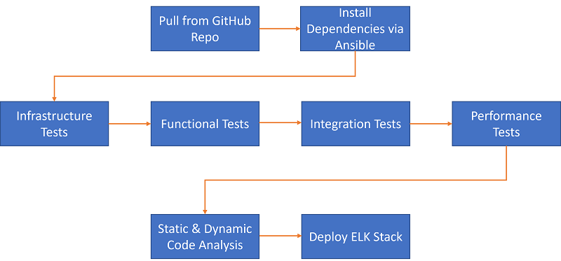

# Ansible Docker ELK - Localhost

Deploy ELK stack with Ansible Docker in localhost

Roles:

* clean - Cleanup task for all docker containers
* packages - Install all packages for environment
* docker - Checks if docker daemon is up and running
* elasticsearch - Deploys elasticsearch container
* kibana - Deploys Kibana container
* logstash - Deploys Logstash container
* heartbeat - Deploys uptime metric container
* metricbeat - Deploys container that collects host system metrics
* filebeat - Deploys container that forwards log files

## Requirement

* Jenkins
* SonarQube
* Ansible
* Docker
* SSH
* Git
* Python3
* ngrok

## Architectural Diagram

## Generate and add ssh key to localhost

`ssh-keygen -t rsa`

`ssh-copy-id -i $USERNAME@localhost`

### Add user to sudoers

`sudo /bin/bash -c "echo \"$USERNAME     ALL=(ALL) NOPASSWD:ALL\" >> /etc/sudoers"`

### Test ssh access.

`ssh $USERNAME@localhost`

## Test Deployment

Test connection

`ansible all -m ping -i inventory`

Deploy elk stack

`ansible-playbook -i inventory elk.yml`

Deploy role only

`ansible-playbook -i inventory elk.yml --tags logstash`

Clean role only

`ansible-playbook -i inventory elk-clean.yml --tags logstash`

Install Packages

`ansible-playbook -i inventory packages.yml`

## Jenkins Integration

### GitHub-Jenkins Integration
#### Jenkins - Git

* Create Freestyle Project
* Select Git in Source Code Management Tab
* Enter Repository URL and Credentials (Github personal access token is necessary)
* Select branch name
* Select projects to build from Post-build Actions as ansible job

#### GitHub WebHook Configuration

* Localhost -> Install ngrok -> ./ngrok http 8080 -> Copy Public Address
* GitHub -> Repository -> Settings -> Webhook -> Enter Copied Jenkins Public Address and add /github-webhook/ to end of Jenkins Public Address

### Ansible-Jenkins Pipeline Job
* Select "Discard old builds"
* Select GitHub project and enter repository information
* Pipeline -> Pipeline script from SCM
* Pipeline -> Enter repository information and Jenkinsfile information

Jenkinsfile includes tests and tasks for Ansible

### Jenkins - SonarQube Integration

* Create SonarQube Project
* Install SonarScanner
* Enter Credential for SonarQube in Jenkins
* Insert SonarQube Analysis step to Jenkinsfile

### TODO

- [x] Deployment of ELK Stack with Beats
- [x] Setting up local environment with Ansible
- [x] Git Webhook
- [x] Jenkins build and deployment of ELK Stack
- [ ] Infrastructure tests, functional tests, integration tests, performance tests
- [x] Configuration update retrigger re-deployment of ELK Stack
- [x] Static Code Analysis
- [ ] Dynamic Code Analysis
- [x] README.md
